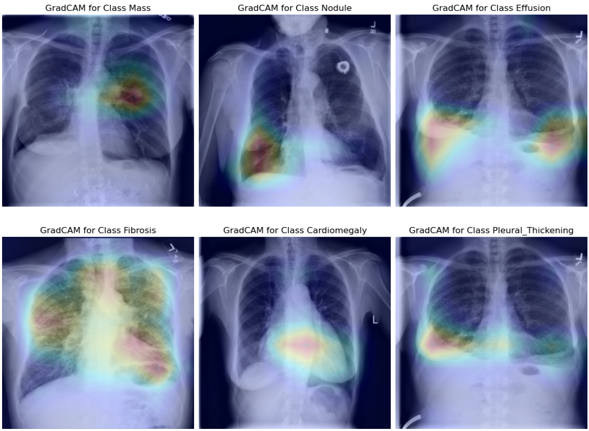

# Code of the Bachelors Thesis: DEEP LEARNING STUDY FOR PULMONARY ILLNESS DIAGNOSIS



## Table of Contents
1. [Project Overview](#project-overview)
2. [Installation](#installation)
3. [Usage](#usage)
    - [Training](#training)
    - [Evaluation](#evaluation)
    - [Prediction](#prediction)
4. [Plotting Results](#plotting-results)
5. [Configuration Flags](#configuration-flags)
    - [Main Script (`main.py`)](#main-script-mainpy)
    - [Plot Script (`plot.py`)](#plot-script-plotpy)
6. [Results](#results)
7. [License](#license)

---

## Project Overview
This is the implementation of the code used for the Bachelors Thesis of Hugo Aranda at Universitat Politècnica de Catalunya. It includes an implementation of a particular Deep Learning architecture for the CheXRay-14 dataset presented in the paper by Wang et al. (2017) [ChestX-Ray8: Hospital-Scale Chest X-Ray Database and Benchmarks on Weakly-Supervised Classification and Localization of Common Thorax Diseases]([https://doi.ieeecomputersociety.org/10.1109/CVPR.2017.369](https://arxiv.org/abs/1705.02315)).
The implementation has a variety of configuration options through flags that can be used in order to modify the Deep Learning architecture to fit various alternatives.
---

## Installation
To get started, clone the repository and install the necessary dependencies using the provided `environment.yml` file.

```bash
git clone https://github.com/hugoarsa/TFG.git
cd TFG
conda env create -f environment.yml
conda activate cuda_dev_1
```

In order for the model to work you need to load the original datset images from the [NIH website]([https://nihcc.app.box.com/v/ChestXray-NIHCC/folder/37178474737]) on the "/resized_images" folder

Also NVIDIA GPU drivers need to be up to date in order to use the GPU acceleration.

---

## Usage

### Training

The best performing model is included as a checkpoint but in order to retrain the model altogether you can use:

```bash
python main.py --mode train
```

This will use default parameters, you can adjust other training parameters using the available configuration flags.

### Evaluation
To evaluate a trained model you can provide the model and prediction model save folder:

```bash
python main.py --mode eval --model efficientb0 --pred_model final_efficientb0_asl2_cyclic_SGD_60
```

### Prediction
In order to generate predictions and GradCAM:

```bash
python main.py --mode pred --pred_model final_efficientb0_asl2_cyclic_SGD_60 --pred_image ./sample_images/00000211_004.png
```

---

## Plotting Results
To visualize the history metrics from the training process you can use the `plot.py` script:

```bash
python plot.py --saves_dir ./saves --output_dir ./docu --target_var val_auc --name performance_plot.png
```

If you want to filter through the folders within saves you can use the `--folders` argument followed by a list of folders.

---

## Configuration Flags

### Main Script (`main.py`)
The following flags control the behavior of the model during training, evaluation, or prediction:

| Flag               | Default                                    | Description                                                                                         | Choices                                                            |
|--------------------|--------------------------------------------|-----------------------------------------------------------------------------------------------------|--------------------------------------------------------------------|
| `--mode`           | `train`                                    | Mode of operation: train, evaluation, or prediction                                                  | `['train', 'eval', 'pred']`                                        |
| `--image_dir`      | `./resized_images`                         | Directory containing the input images                                                               | N/A                                                                |
| `--pred_model`     | `final_efficientb0_asl2_cyclic_SGD_60`     | Model checkpoint to use for predictions and evaluation                                                             | N/A                                                                |
| `--pred_image`     | `00000211_004.png`                         | Image file for prediction                                                                            | N/A                                                                |
| `--train_csv`      | `./labels/train_metadata.csv`              | Training metadata                                                                                   | N/A                                                                |
| `--val_csv`        | `./labels/val_metadata.csv`                | Validation metadata                                                                    | N/A                                                                |
| `--test_csv`       | `./labels/test_metadata.csv`               | Test metadata                                                                          | N/A                                                                |
| `--save_dir`       | `./saves`                                  | Directory where logs and model checkpoints will be saved                                             | N/A                                                                |
| `--model`          | `efficientb0`                              | Neural Network model to be used                                                                      | `['res18', 'res50', 'dense121', 'efficientb0', 'efficientb4']`     |
| `--untrained`      | `False`                                    | Specify whether the model is untrained (not pre-trained on ImageNet)                                 | `True/False`                                                       |
| `--thresh`         | `False`                                    | Use dynamic threshold                                                                                | N/A                                                                |
| `--max_epochs`     | `60`                                       | Maximum number of epochs for training                                                                | N/A                                                                |
| `--num_iter`       | `None`                                     | Maximum iterations per epoch                                                                         | N/A                                                                |
| `--batch_size`     | `32`                                       | Batch size for data loaders                                                                          | N/A                                                                |
| `--img_size`       | `256`                                      | Desired image size for the dataset                                                                   | N/A                                                                |
| `--loss`           | `asl2`                                     | Loss function to use                                                                                 | `['bce', 'bce_w', 'focal', 'asymmetric', 'asl1', 'asl2', 'asl3']`  |
| `--lr`             | `5e-4`                                     | Learning rate                                                                                        | N/A                                                                |
| `--opt`            | `Adam`                                     | Optimizer algorithm                                                                                  | `['SGD', 'Adam', 'AdamW', 'RMSprop']`                              |
| `--scheduler`      | `plateau1`                                 | Learning rate scheduler to use                                                                       | `['plateau', 'cyclic', 'cosine', 'warmupcosine']`                  |
| `--e_patience`     | `15`                                       | Patience for early stopping                                                                          | N/A                                                                |
| `--s_patience`     | `6`                                        | Patience for the learning rate scheduler                                                             | N/A                                                                |

### Plot Script (`plot.py`)
The following flags are available for generating plots:

| Flag               | Default               | Description                                                                                         |
|--------------------|-----------------------|-----------------------------------------------------------------------------------------------------|
| `--saves_dir`      | `./saves`             | Directory where model checkpoints are saved                                                         |
| `--output_dir`     | `./docu`              | Directory where the plots will be saved                                                             |
| `--target_var`     | `val_auc`             | Variable to plot (e.g., validation accuracy or loss)                                                 |
| `--name`           | `loss_selection_plot.png` | Name of the output plot file                                                                         |
| `--folders`        | None                  | List of specific folder names to include in the plot                                                 |

---

## Results
See results at the published Memory for the project in the upc commons field.

---

## License
This project is licensed under the MIT License. See the [LICENSE](./LICENSE) file for details.
